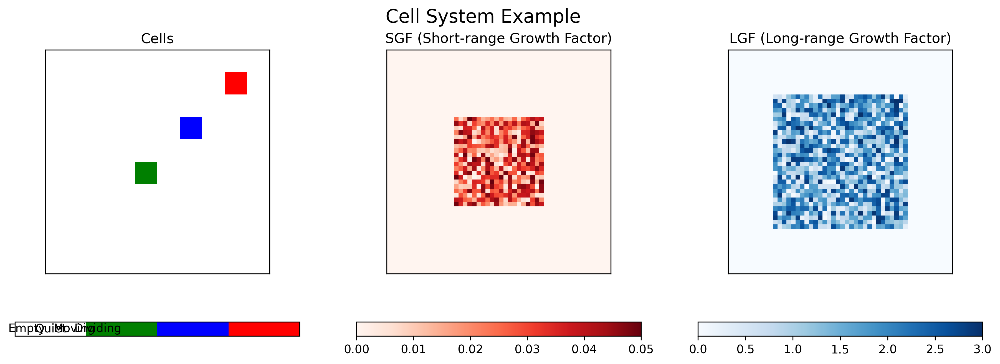
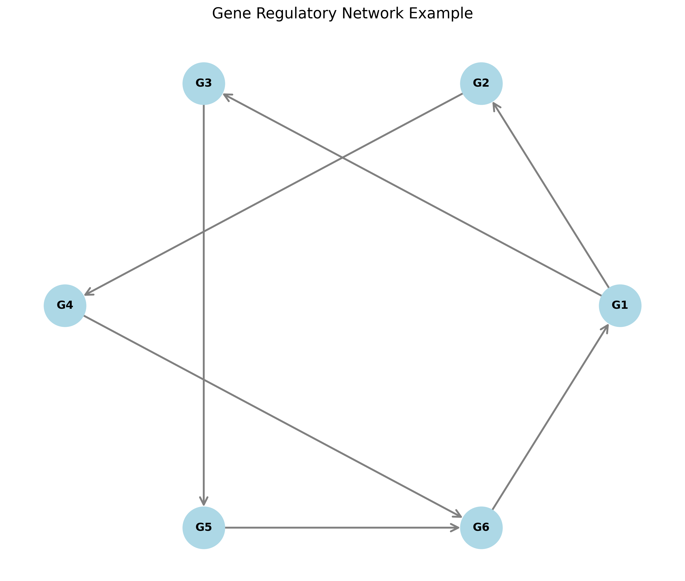
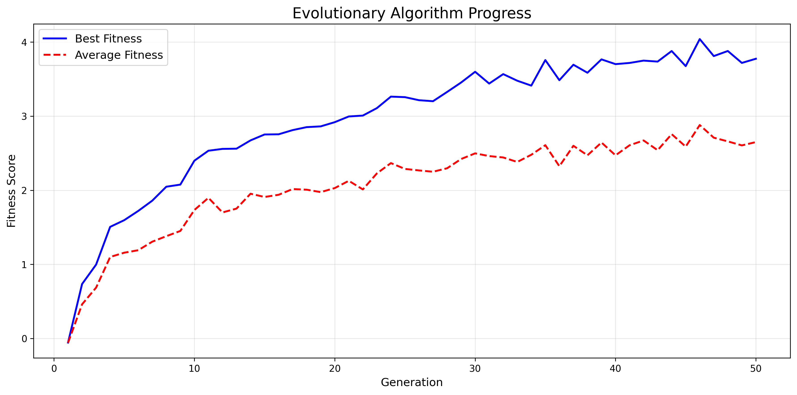

# 🧬 Simulation of Gene Regulatory Networks Driving Shape Homeostasis

This repository contains the software developed as part of the master’s thesis

**“Classification of Gene Regulatory Networks Driving Shape Homeostasis”**  

by **M.Sc. J. Esteban Pérez-Hidalgo** (School of Physics, Costa Rica Institute of Technology), under the supervision of **PhD. Philip Gerlee** (Department of Mathematical Sciences, University of Gothenburg & Chalmers University of Technology, Sweden).

---

## 📌 Overview

This software allows the **simulation and classification of Gene Regulatory Networks (GRNs)** that drive **shape homeostasis** in multicellular systems — a key emergent phenomenon in developmental biology and artificial life.

The simulation is entirely written in **Python** and is based on the framework proposed by **Gerlee et al.** in the study _“The influence of cellular characteristics on the evolution of shape homeostasis”_, supported by several foundational models in the field of artificial life cited in the thesis.

---

## 🎯 Purpose

- To simulate multicellular collectives and observe adaptive behavior under dynamic environments.
- To classify GRNs that can maintain **shape homeostasis** in different environmental conditions.
- To explore the role of **growth factors**, **cell–cell interactions**, and **internal cellular actions** in emergent behavior.
- To demonstrate that **three major behavioral classes** lead to shape homeostasis.
- To showcase cellular responses as a function of different environmental types.

---

## 🧪 Methods and Technologies

This software combines a range of well-established computational techniques:

- 🔲 **Cellular Automata** — for modeling spatial environments and local cell dynamics.
- 🧠 **Artificial Neural Networks** — to implement gene regulatory networks within each cell.
- 🔍 **Optimization Algorithms** — to evolve adaptive networks and collective behavior.

These components interact to simulate the dynamics of cellular collectives, where behavior arises from:

- A dynamic equilibrium of cellular actions,
- The interaction between two growth factors enabling communication,
- And a signaling network acting as a **gene regulatory network**.

---

## 🚀 Quick Start

### Prerequisites

- **Docker** (recommended) - No local Python installation needed
- **Python 3.7+** (for local development)

### Installation

#### Option 1: Docker (Recommended)

```bash
# Clone the repository
git clone https://github.com/your-username/simulation-of-gene-regulatory-networks-driving-shape-homeostasis.git
cd simulation-of-gene-regulatory-networks-driving-shape-homeostasis

# Start the web interface (no local Python installation needed)
./run_docker.sh
```

#### Option 2: Local Installation

```bash
# Clone the repository
git clone https://github.com/your-username/simulation-of-gene-regulatory-networks-driving-shape-homeostasis.git
cd simulation-of-gene-regulatory-networks-driving-shape-homeostasis

# Install dependencies
pip install -r requirements.txt
```

### Basic Usage

#### 🌐 Web Interface (Recommended)

```bash
# Start the containerized web application
./run_docker.sh

# Open your browser and go to: http://localhost:8501
# Interactive interface with real-time visualization
```

The web interface provides:
- **Interactive simulation controls** with real-time parameter adjustment
- **Live visualization** of cell states, SGF, and LGF concentrations
- **Fitness analysis** tools and evolutionary progress tracking
- **Parameter exploration** for different network architectures

#### 💻 Command Line

```bash
# Run a simple simulation example
python examples/run_simulation.py

# Run genetic algorithm example
python examples/run_evolution.py

# Run main applications directly
python core/main.py [filename] [nNodes] [individual]
python evolution/main_ga.py [filename] [parameters]
```

---

## 📁 Project Structure

```
├── core/                    # Core simulation components
│   ├── cell_agent.py        # Cell class and neural network
│   ├── main.py              # Basic simulation engine
│   └── tools.py             # Utility functions
├── evolution/               # Genetic algorithm
│   ├── main_ga.py           # Main GA application
│   └── tools_ga.py          # GA utilities
├── visualization/           # Plotting and visualization
│   └── plot.py              # Plotting functions
├── config/                  # Configuration files
│   └── config-ca            # NEAT configuration
├── analysis/                # Research tools
│   ├── graph_generator.py   # Network generation
│   └── graph_evaluation.py  # Network evaluation
├── examples/                # Usage examples
│   ├── run_simulation.py    # Basic simulation example
│   └── run_evolution.py     # GA example
├── web_app.py               # Streamlit web application
├── neat_cell_agent.py       # NEAT-based cell agent implementation
├── neat_parallel.py         # Parallel NEAT implementation
├── plots_gp                 # Gnuplot configuration
├── run_web_app.sh           # Local web app launcher script
├── Dockerfile               # Container configuration
├── docker-compose.yml       # Container orchestration
├── run_docker.sh            # Container launcher script
├── .dockerignore            # Docker build exclusions
├── requirements.txt         # Dependencies
├── README.md                # Main project documentation
├── docs/                    # Documentation
│   ├── web-interface.md     # Web interface documentation
│   ├── docker.md            # Docker usage guide
│   ├── thesis-summary.md    # Research overview
│   └── history-log.md       # Development history
```

### 🏗️ Architecture Overview

- **`core/`**: Core simulation engine with cellular automata and neural networks
- **`evolution/`**: Genetic algorithm implementation for network optimization
- **`visualization/`**: Plotting and visualization tools
- **`analysis/`**: Research and evaluation tools
- **`examples/`**: Ready-to-run examples for different use cases
- **`web_app.py`**: Interactive web interface using Streamlit
- **`Dockerfile`**: Container configuration for reproducible environments

---

## 🧬 Scientific Contribution

This software represents a **novel, multidisciplinary product**, combining:

- **Computational Physics** - Cellular automata and spatial dynamics
- **Numerical Methods in Mathematics** - Differential equations and optimization
- **Computational Biology** - Gene regulatory networks and emergent behavior

It provides a computational platform for studying **emergent homeostasis**, offering insights into how multicellular systems organize and regulate their shape.

### 📊 Example Visualizations

#### Cell System Simulation


*The simulation shows cells in different states (empty, quiet, moving, dividing) alongside SGF and LGF concentration patterns.*

#### Gene Regulatory Network


*Example of a gene regulatory network with feedback loops and regulatory interactions.*

#### Evolutionary Progress


*Typical fitness progression during genetic algorithm optimization.*

### 🔬 Research Applications

- **Developmental Biology**: Understanding shape formation and maintenance
- **Artificial Life**: Exploring emergent behavior in cellular systems
- **Systems Biology**: Modeling gene regulatory networks
- **Evolutionary Computation**: Optimizing network architectures

### 📊 Key Features

- **Interactive Web Interface**: Real-time simulation control and visualization
- **Containerized Deployment**: Reproducible environments with Docker
- **Modular Architecture**: Clean separation of concerns
- **Comprehensive Documentation**: Detailed explanations and examples

---

## 👨‍🏫 Authors

- **M.Sc. J. Esteban Pérez-Hidalgo** (School of Physics, Costa Rica Institute of Technology)
  - Master's Thesis – University of Gothenburg & Chalmers University of Technology  
  - Email: jose.perez@tec.ac.cr
- **Reymer Vargas** - Project modernization and development
  - Containerization, web interface, and documentation improvements

## 👥 Contributors

This project has benefited from contributions by:

- **Esteban** - Original research and initial implementation
- **Reymer Vargas** - Project modernization, documentation, containerization, and web interface development

## 🚀 Development History

### Original Research (Esteban)
- Master's thesis on gene regulatory networks and shape homeostasis
- Initial implementation of cellular automata and neural networks
- Core simulation engine and genetic algorithm

### Modernization (Reymer Vargas)
- **Documentation**: Comprehensive documentation restructuring and improvements
- **Containerization**: Docker setup for reproducible environments
- **Web Interface**: Interactive Streamlit application for real-time simulation
- **Code Quality**: PEP8 compliance and project structure improvements
- **Deployment**: Production-ready containerized deployment


